# Talk-A-Tive - Visual Architecture Diagrams

This document contains visual diagrams of the project architecture using Mermaid syntax. These diagrams render beautifully in GitHub, VS Code, and most markdown viewers.

---

## 1. System Architecture Overview

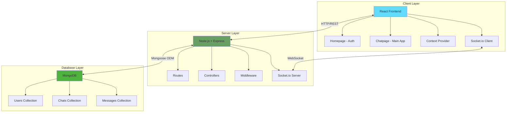

---

## 2. Frontend Component Hierarchy

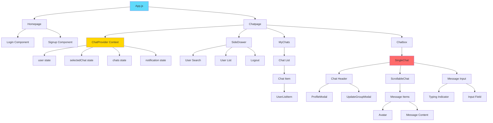

---

## 3. Backend MVC Architecture

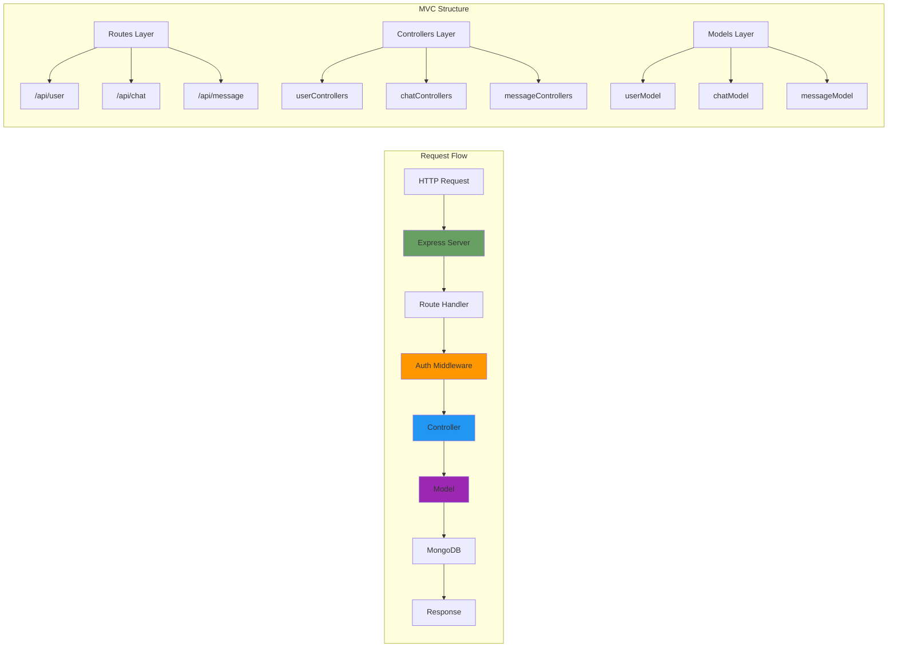

---

## 4. Database Schema Relationships

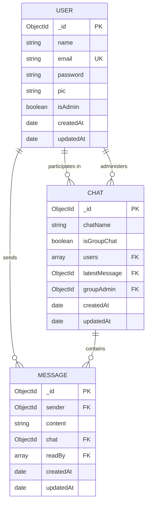

---

## 5. Real-time Message Flow

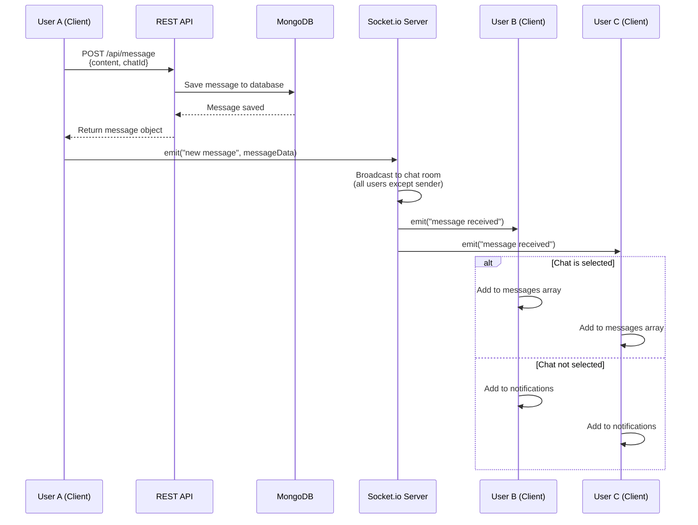

---

## 6. Authentication Flow

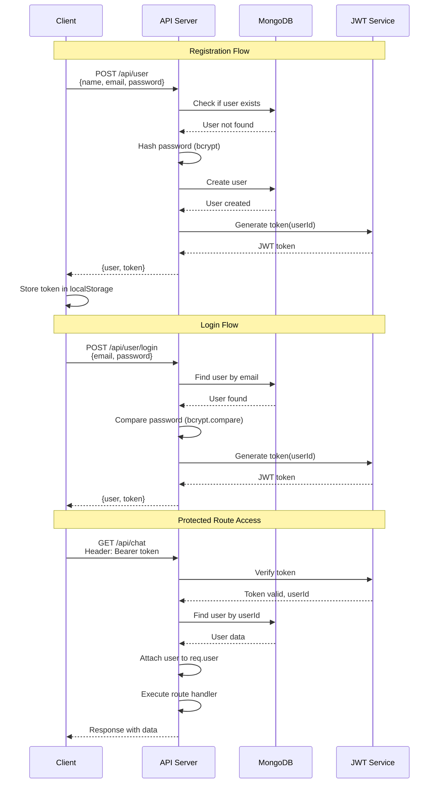

---

## 7. Socket.io Room Architecture

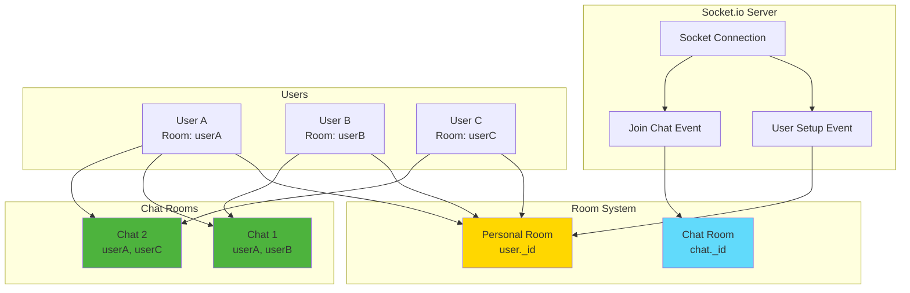

---

## 8. Chat Creation Flow

```mermaid
flowchart TD
    A[User A clicks User B] --> B[POST /api/chat<br/>{userId: userB}]
    B --> C{Auth Middleware}
    C -->|Invalid Token| D[401 Unauthorized]
    C -->|Valid Token| E[Controller: accessChat]
    
    E --> F[Query MongoDB:<br/>Find chat between<br/>User A and User B]
    
    F --> G{Chat Exists?}
    
    G -->|Yes| H[Return Existing Chat]
    G -->|No| I[Create New Chat]
    
    I --> J[Chat Data:<br/>users: [userA, userB]<br/>isGroupChat: false]
    J --> K[Save to MongoDB]
    K --> L[Populate Users]
    L --> M[Return Chat Object]
    
    H --> N[Update UI]
    M --> N
    
    style C fill:#ff9800
    style G fill:#2196f3
    style H fill:#4caf50
    style M fill:#4caf50
```

---

## 9. State Management Flow

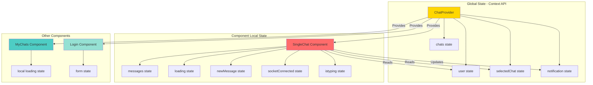

---

## 10. API Endpoints Structure

```mermaid
graph TD
    A[Express Server] --> B[/api/user]
    A --> C[/api/chat]
    A --> D[/api/message]
    
    B --> B1[GET /api/user?search=query<br/>Protected]
    B --> B2[POST /api/user<br/>Public - Register]
    B --> B3[POST /api/user/login<br/>Public - Login]
    
    C --> C1[POST /api/chat<br/>Protected - Access/Create]
    C --> C2[GET /api/chat<br/>Protected - Fetch All]
    C --> C3[POST /api/chat/group<br/>Protected - Create Group]
    C --> C4[PUT /api/chat/rename<br/>Protected - Rename]
    C --> C5[PUT /api/chat/groupadd<br/>Protected - Add User]
    C --> C6[PUT /api/chat/groupremove<br/>Protected - Remove User]
    
    D --> D1[GET /api/message/:chatId<br/>Protected - Get Messages]
    D --> D2[POST /api/message<br/>Protected - Send Message]
    
    style A fill:#68a063
    style B fill:#2196f3
    style C fill:#ff9800
    style D fill:#9c27b0
```

---

## 11. Typing Indicator Flow

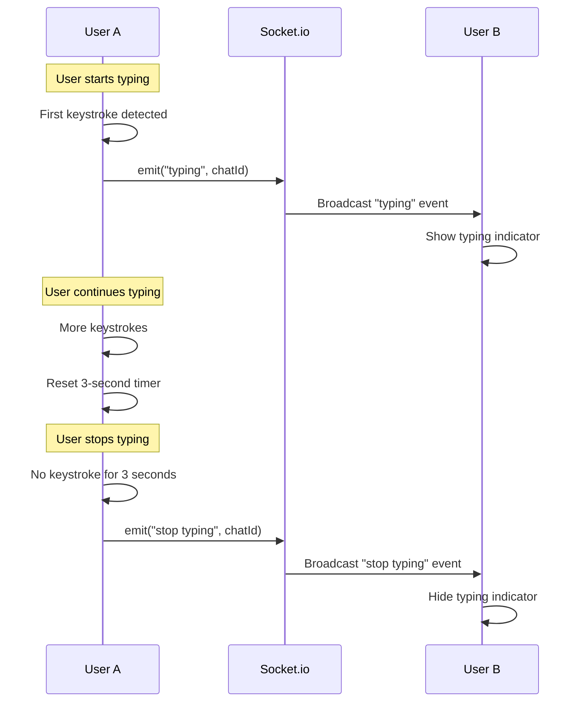

---

## 12. Notification System Flow

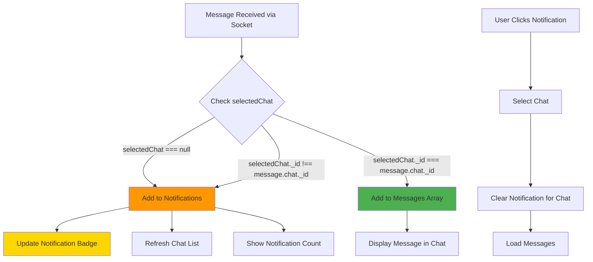

---

## 13. Production Deployment Architecture

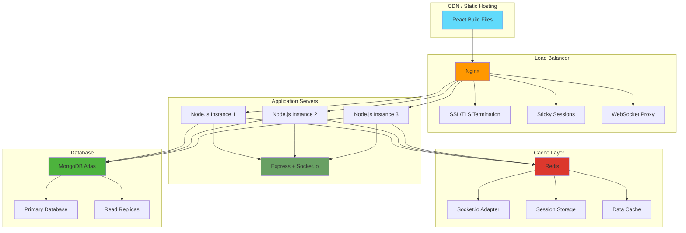

---

## 14. Complete Data Flow - Message Sending

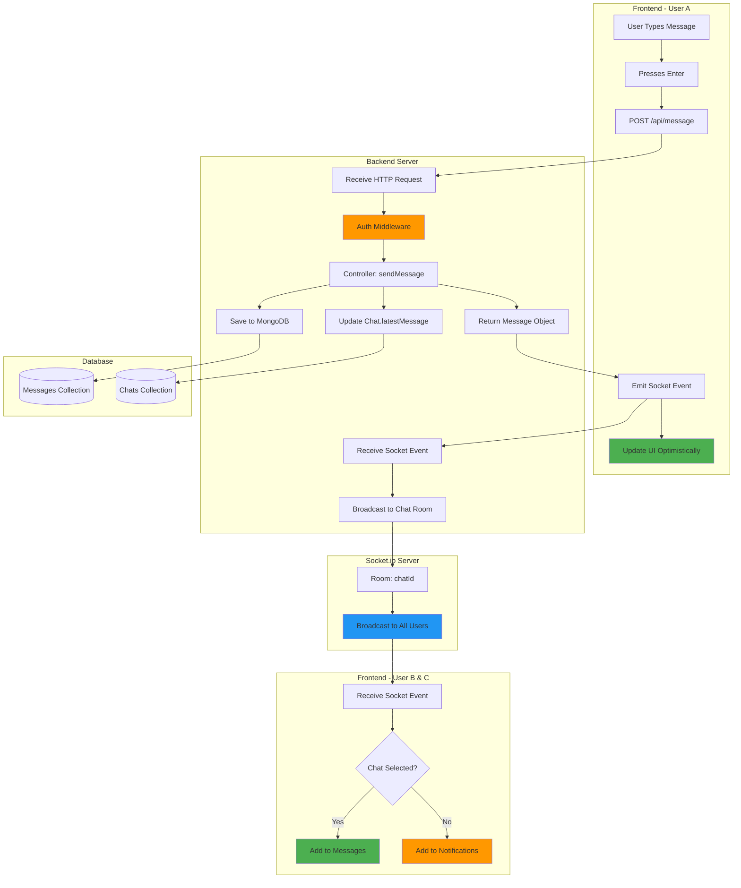

---

## 15. Component Communication Diagram

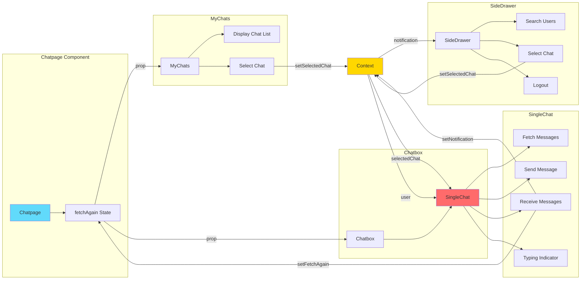

---

## How to View These Diagrams

### In VS Code:
1. Install "Markdown Preview Mermaid Support" extension
2. Open this file and use Markdown Preview

### In GitHub:
- Diagrams render automatically when you push this file

### Online:
- Copy diagram code to https://mermaid.live/
- View and export as PNG/SVG

### In Other Editors:
- Use Mermaid plugins/extensions for your editor
- Or use online Mermaid editor

---

## Diagram Legend

- **Blue**: Frontend/Client components
- **Green**: Backend/Server components
- **Yellow**: State/Context
- **Orange**: Middleware/Auth
- **Purple**: Database/Models
- **Red**: Real-time/Socket.io

---

These diagrams provide a comprehensive visual representation of your project's architecture. Use them for documentation, presentations, or explaining your project to others!

